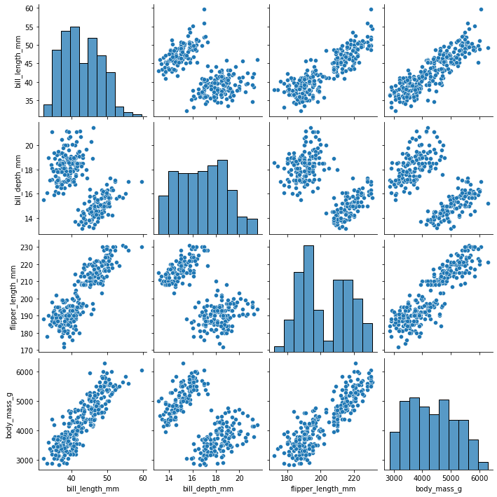

# Prepare for Visualization
<!-- TOC -->
* [Prepare for Visualization](#prepare-for-visualization)
* [Imports](#imports)
* [Basic Data Exploration](#basic-data-exploration)
  * [Load Data](#load-data)
  * [Create a Dataset](#create-a-dataset)
  * [Display the first 10 rows of the data.](#display-the-first-10-rows-of-the-data)
  * [Get the statistical properties of the dataset. Ignores null values](#get-the-statistical-properties-of-the-dataset-ignores-null-values)
  * [Get the shape of the dataset](#get-the-shape-of-the-dataset)
  * [Get the range of different values in the dataset.](#get-the-range-of-different-values-in-the-dataset)
  * [Display the data types of the columns.](#display-the-data-types-of-the-columns)
  * [Sort](#sort)
  * [Show rows with NA values](#show-rows-with-na-values)
  * [Boolean Mask](#boolean-mask)
  * [New Columns](#new-columns)
  * [Drop Duplicates](#drop-duplicates)
  * [Backfill Missing Values](#backfill-missing-values)
  * [Merging or Combining DataFrames](#merging-or-combining-dataframes)
  * [Grouping Data](#grouping-data)
  * [Reset Index](#reset-index)
  * [Remove Outliers](#remove-outliers)
  * [Show Value Counts](#show-value-counts)
* [Data Manipulation](#data-manipulation)
  * [Convert date to datetime](#convert-date-to-datetime)
  * [Get month/day/etc from datetime](#get-monthdayetc-from-datetime)
  * [String Manipulation for Dates](#string-manipulation-for-dates)
  * [Datetime Conversions and Groupings](#datetime-conversions-and-groupings)
  * [Strip Values from Strings](#strip-values-from-strings)
  * [Replace a specific cell content](#replace-a-specific-cell-content)
  * [Use a set to find incorrect categories](#use-a-set-to-find-incorrect-categories)
  * [Replace Data in Dataframe Using Map](#replace-data-in-dataframe-using-map)
  * [Dummie Categories](#dummie-categories)
  * [Category Codes](#category-codes)
  * [Label Encoding](#label-encoding)
  * [Categorical Designation](#categorical-designation)
  * [Apply a Function to DataFrame](#apply-a-function-to-dataframe)
* [Missing Data](#missing-data)
  * [Use a Set to Determine Missing Data](#use-a-set-to-determine-missing-data)
  * [Create New DataFrame From Rows that are Missing Data](#create-new-dataframe-from-rows-that-are-missing-data)
  * [Find Null or Missing Values](#find-null-or-missing-values)
  * [Get a subset of rows](#get-a-subset-of-rows)
* [Math](#math-)
  * [Divide](#divide)
  * [Sum](#sum)
  * [Aggregations](#aggregations)
  * [Median](#median)
  * [Mean](#mean)
  * [Quantile](#quantile)
  * [Interquartile Range - IQR and Outliers](#interquartile-range---iqr-and-outliers)
  * [Standard Deviation](#standard-deviation)
  * [Empirical rule](#empirical-rule)
  * [Sample](#sample)
  * [Central Limit Theorem](#central-limit-theorem)
  * [Confidence Interval](#confidence-interval)
      * [`scale`: The sample standard error](#scale-the-sample-standard-error)
  * [One-sample t-test](#one-sample-t-test)
  * [Two-sample t-test, independent](#two-sample-t-test-independent)
  * [Quantile-Quantile plot](#quantile-quantile-plot)
* [Visualization](#visualization)
  * [Size](#size)
  * [Labels](#labels)
  * [Boxplot](#boxplot)
  * [Barplot](#barplot)
  * [Scatterplot](#scatterplot)
  * [Pairplot](#pairplot)
  * [Scatter Geometric](#scatter-geometric)
  * [Histogram](#histogram)
  * [Pie Chart](#pie-chart)
  * [Heatmap](#heatmap)
  * [Simple Linear Regression](#simple-linear-regression)
* [Miscellanea](#miscellanea)
  * [Nan](#nan)
  * [Jupyter Notebook](#jupyter-notebook)
  * [Select All Instances of Text In PyCharm](#select-all-instances-of-text-in-pycharm)
  * [Pycharm Move to End of Word](#pycharm-move-to-end-of-word)
<!-- TOC -->
# Imports

```python
# data manipulation
import pandas as pd


# data visualization
import seaborn as sns
import matplotlib.pyplot as plt
import plotly.express as px

# data preprocessing
import numpy as np
from scipy import stats

# data modeling
import statsmodels.api as sm
```

``python
# Import packages for data manipulation
import pandas as pd
import numpy as np

# Import packages for data visualization
import matplotlib.pyplot as plt
import seaborn as sns

# Import packages for data preprocessing
from sklearn.preprocessing import OneHotEncoder
from sklearn.feature_extraction.text import CountVectorizer, TfidfVectorizer
from sklearn.utils import resample

# Import packages for data modeling
from sklearn.model_selection import train_test_split
from sklearn.linear_model import LogisticRegression
from sklearn.metrics import classification_report
from sklearn.metrics import confusion_matrix, ConfusionMatrixDisplay``

# Basic Data Exploration

## Load Data

```python
df_companies = pd.read_csv("Unicorn_Companies.csv")
```

## Create a Dataset
```python
## # list of strings
lst = ['Geeks', 'For', 'Geeks', 'is', 
            'portal', 'for', 'Geeks']
# Calling DataFrame constructor on list
df = pd.DataFrame(lst)
```

## Display the first 10 rows of the data.
```python
df_companies.head(10)
```

## Get the statistical properties of the dataset. Ignores null values
```python
df_companies.describe()
```

```commandline
count    634.000000
mean      73.395189
std       10.098460 #standard deviation
min       37.220000
25%       66.437500
50%       73.490000
75%       80.815000
max       98.760000
Name: OVERALL_LI, dtype: float64
```

## Get the shape of the dataset
`df_companies.shape`

## Get the range of different values in the dataset.
`df_companies.info()`

## Display the data types of the columns.
`companies.dtypes`

## Sort
```python
# Sort `companies` and display the first 10 rows of the resulting DataFrame.
companies.sort_values(by='Year Founded', ascending = False).head(10)
```

## Show rows with NA values
```python
nan_df = df.isna()
print(nan_df)

data.isna().sum()
```

Display each unique year that occurs in the dataset
along with the number of companies that were founded in each unique year.

```
companies['Year Founded'].value_counts().sort_values(ascending=False)
```

## Boolean Mask
```python
pre_mask = all_reviews_df[‘reviewTimestamp’].dt.year == 2019
during_mask = all_reviews_df[‘reviewTimestamp’].dt.year == 2020
reviews_df = all_reviews_df[pre_mask | during_mask]
```

## New Columns
```python
# Create a new column "Year Joined" from "Date Joined".

df_companies["Year_Joined"] = pd.to_datetime(df_companies["Date Joined"]).dt.year
df_companies.head()

# Remove the extra characters from the Valuation column.
df_companies['Valuation_num'] = df_companies['Valuation'].str.strip('$B')

# Convert the column to numeric
df_companies['Valuation_num'] = pd.to_numeric(df_companies['Valuation_num'])
```

## Rename Columns
```python
df.rename(columns={"A": "a", "B": "b", "C": "c"}, errors="raise")
```

## Drop Duplicates
```python
# Drop the rows containing missing values. 
count_dropna_rows = df_companies.dropna().size
count_dropna_rows

# Drop the columns containing missing values.
count_dropna_columns  = df_companies.dropna(axis=1).size
count_dropna_columns

companies.drop_duplicates()

companies.drop_duplicates(subset=['Company'],inplace=True)
```

## Drop NA
If a specific column is blank
```python
#Define in which columns to look for missing values.

df.dropna(subset=['name', 'toy'])
```

## Backfill Missing Values
```python
# Fill missing values using 'backfill' method.
df_companies_backfill  = df_companies.fillna(method='bfill')
# Showing the rows that previously had missing values.
df_companies_backfill.loc[df_rows_missing.index]
```

## Merging or Combining DataFrames
```python
# Investing search criteria provided as a DataFrame.
df_search = pd.DataFrame({
    'City':['Beijing','San Francisco','London','London'],
    'Industry':['Hardware','Hardware','Artificial intelligence','Hardware']
})
df_invest = df_search.merge(df_companies,on=['City','Industry'])
print(df_invest[['City','Industry','Company']])

# Create new dataframe combining 2016–2017 data with 2018 data
union_df = pd.concat([df.drop(['weekday','week'],axis=1), df_2], ignore_index=True)
union_df.head()

# Combine `lightning_by_month` and `lightning_by_year` dataframes into single dataframe
percentage_lightning = lightning_by_month.merge(lightning_by_year,on='year')
percentage_lightning.head()

# Left-join the two datasets
df_joined = df.merge(df_zip, how='left', on=['date','center_point_geom'])
```

## Grouping Data
```python
#Group the data by`Country/Region`
df_companies_sum = df_companies.groupby(['Country/Region'])['Valuation_num'].sum().sort_values(ascending=False).reset_index()

#Print the top 15 values of the DataFrame.
df_companies_sum.head(15)

# Create a new dataframe view of just 2018 data, summed by week.
df_by_week_2018 = df[df['year'] == '2018'].groupby(['week']).sum().reset_index()
df_by_week_2018.head()
```

## Reset Index
You can review the documentation for dropna() and reset_index(). In short, the dropna() function by default removes any 
rows with any missing values in any of the columns. The reset_index() function resets the index values for the rows in 
the dataframe. Typically, you use reset_index() after you've finished manipulating the dataset. By setting inplace=True, 
you will not create a new DataFrame object. By setting drop=True, you will not insert a new index column into the DataFrame object.
```python
penguins_final.reset_index(inplace=True, drop=True)
```

## Remove Outliers
```python
# Remove outlier countries.
df_companies_sum_outliers_removed= df_companies_sum[~df_companies_sum['Country/Region'].isin(['China','India','United States','United Kingdom'])]
df_companies_sum_outliers_removed.head()
```
Next, create four new columns: week, month, quarter, and year. You can do this by using the datetime.strftime() method of your datetime object. strftime is short for "string format time." You will use this method on the datetime data in the week column, and it will extract the information you specify, formatted as a string.

To specify the information to extract, use strftime format codes. You can find a full list of available codes to use in the strftime format codes documentation. In this case, you will use %Y for year, %V for week number, %q for quarter.

```python
# Create four new columns.
df['week'] = df['date'].dt.strftime('%Y-W%V')
df['month'] = df['date'].dt.strftime('%Y-%m')
df['quarter'] = df['date'].dt.to_period('Q').dt.strftime('%Y-Q%q')
df['year'] = df['date'].dt.strftime('%Y')
```

## Show Value Counts
```python
# Identify locations that appear most in the dataset
df.center_point_geom.value_counts()

# Identify top 20 locations with most days of lightning
df.center_point_geom.value_counts()[:20].rename_axis('unique_values').reset_index(name='counts').style.background_gradient()
```

# Data Manipulation

Link for all the string format directives, like %Y, %y, etc:
https://docs.python.org/3/library/datetime.html#strftime-and-strptime-behavior

## Convert date to datetime
```python
# Convert the `date` column to datetime.
df['date'] = pd.to_datetime(df['date'])
```

## Get month/day/etc from datetime
```python
# Obtain the names of the months when companies gained unicorn status.
# Use the result to create a `Month Joined` column.
companies['Month'] = companies['Date Joined'].dt.month


companies['Month Joined'] = companies['Date Joined'].dt.month_name()
# Display the first few rows of `companies`
# to confirm that the new column did get added.

# Create two new columns
df['week'] = df.date.dt.isocalendar().week
df['weekday'] = df.date.dt.day_name()
df.head()

# Create categorical designations
months = ['Jan', 'Feb', 'Mar', 'Apr', 'May', 'Jun', 'Jul', 'Aug', 'Sep', 'Oct', 'Nov', 'Dec']

# Encode `month` column as categoricals 
df['month'] = pd.Categorical(df['month'], categories=months, ordered=True)
```

## String Manipulation for Dates
```python
# Insert a `Week Joined` column into `companies_2021.`
companies_2021.insert(3,'Week Joined',companies_2021['Date Joined'].dt.strftime('%Y-W%V'),True)

# Group `companies_2021` by `Week Joined`. 
# Aggregate by counting companies that joined per week of 2021.
# Save the resulting DataFrame in a new variable.
companies_by_week_2021 = companies_2021.groupby(by="Week Joined")["Company"].count().reset_index().rename(columns={"Company":"Company Count"})


# Add `Quarter Joined` column to `companies_2021`.
companies_2020_2021["Quarter Joined"] = companies_2020_2021["Date Joined"].dt.to_period('Q').dt.strftime('%Y-Q%q')

# Create a new `month_txt` column.
df['month_txt'] = df['date'].dt.month_name().str.slice(stop=3)
df.head()
```

## Datetime Conversions and Groupings
```python
# Convert `date` column to datetime
df_1987['date'] = pd.to_datetime(df_1987['date'])

# Create 2 new columns
df_1987['month'] = df_1987['date'].dt.month
df_1987['month_txt'] = df_1987['date'].dt.month_name().str.slice(stop=3)

# Group by `month` and `month_txt`, sum it, and sort. Assign result to new df
df_1987_by_month = df_1987.groupby(['month','month_txt']).sum().sort_values('month', ascending=True).head(12).reset_index()
df_1987_by_month
```

## Strip Values from Strings
```python
# Convert the `Valuation` column to numeric by removing `$` and `B` and casting each value to data type `float`.
companies_2020_2021["Valuation"] =  companies_2020_2021["Valuation"].str.strip("$B").astype(float)
```

## Replace a specific cell content
```python

# Determine which companies have a negative years to unicorn
print(companies[companies['Years To Unicorn'] < 0]['Company'].values)

# Replacing the Year Founded for InVision with 2011 (which was determined from an internet search)
companies.loc[companies['Company'] == 'InVision', 'Year Founded'] = 2011
```

## Use a set to find incorrect categories
```python
# List provided by the company of the expected industry labels in the data
industry_list = ['Artificial intelligence', 'Other','E-commerce & direct-to-consumer', 'Fintech',\
       'Internet software & services','Supply chain, logistics, & delivery', 'Consumer & retail',\
       'Data management & analytics', 'Edtech', 'Health', 'Hardware','Auto & transportation', \
        'Travel', 'Cybersecurity','Mobile & telecommunications']

#Correct misspelled Industry values in companies.

print(companies['Industry'].nunique())

# Define a dictionary that maps the incorrect industry spellings to their correct industry spelling
industry_dct = {'Artificial Intelligence':'Artificial intelligence',
                'Data management and analytics':'Data management & analytics',
                'FinTech':'Fintech'}
companies['Industry'] = companies['Industry'].replace(industry_dct)

print(companies['Industry'].nunique())
```

## Replace Data in Dataframe Using Map
Two common methods for changing categorical data to numerical are creating dummy variables and label encoding. 
There is no best method, as the decision on which method to use depends on the context and must be made on a case-to-case basis.

```python
industry_dct = {'Artificial Intelligence':'Artificial intelligence',
                'Data management and analytics':'Data management & analytics',
                'FinTech':'Fintech'}
companies['Industry'] = companies['Industry'].replace(industry_dct)
```

## Dummie Categories
```python
# Convert Valuation to numeric.
# Create a 'simplified' representation of Valuation with two categories: 
# one that denotes if the Valuation was in the top 50% of valuations in the data and one if it was not.
companies['High Valuation'] = pd.qcut(companies['Valuation'],2,labels=['No','Yes'])

companies['High Valuation'] = companies['High Valuation'].cat.codes
companies.head()  

# Convert Industry to numeric data.
industry_encoded = pd.get_dummies(companies['Industry'],drop_first=True)

companies = pd.concat([companies,industry_encoded],axis=1)
# drop_first
# bool, default False
# Whether to get k-1 dummies out of k categorical levels by removing the first level.

# Create a dummy variable that denotes if Accel is a Select Investor.
companies['Accel'] = companies['Select Investors'].str.contains('Accel')
companies['Accel'] = companies['Accel'].astype(int)
```

## Category Codes
```python
companies['High Valuation'] = companies['High Valuation'].cat.codes
companies.head()  

cat = pd.Categorical(['a', 'b'], ordered=True)
cat.codes
array([0, 1], dtype=int8)

# Convert Country/Region to numeric data.
companies['Country/Region'] = companies['Country/Region'].astype('category').cat.codes


# Create a new column that categorizes number_of_strikes into 1 of 4 categories
df_by_month['strike_level'] = pd.qcut(
    df_by_month['number_of_strikes'],
    4,
    labels = ['Mild', 'Scattered', 'Heavy', 'Severe'])
df_by_month.head()
# Create new column representing numerical value of strike level
# We can also create binary "dummy" variables from the strike_level column. This is a useful tool if we'd like to pass the categorical variable into a model. 
# To do this, we could use the function pd.get_dummies(). 
# Note that this is just to demonstrate the functionality of pd.get_dummies(). 
# Simply calling the function as we do below will not convert the data unless we reassigned the result back to a dataframe.
df_by_month['strike_level_code'] = df_by_month['strike_level'].cat.codes
df_by_month.head()
pd.get_dummies(df_by_month['strike_level'])
```

## Label Encoding
```python
# Create a new column that categorizes number_of_strikes into 1 of 4 categories
df_by_month['strike_level'] = pd.qcut(
    df_by_month['number_of_strikes'],
    4,
    labels = ['Mild', 'Scattered', 'Heavy', 'Severe'])
df_by_month.head()
```

## Categorical Designation
```python
# Create categorical designations
months = ['Jan', 'Feb', 'Mar', 'Apr', 'May', 'Jun', 'Jul', 'Aug', 'Sep', 'Oct', 'Nov', 'Dec']

# Encode `month` column as categoricals 
df['month'] = pd.Categorical(df['month'], categories=months, ordered=True)
```

## Apply a Function to DataFrame
```python
def readable_numbers(x):
    """takes a large number and formats it into K,M to make it more readable"""
    if x >= 1e6:
        s = '{:1.1f}M'.format(x*1e-6)
    else:
        s = '{:1.0f}K'.format(x*1e-3)
    return s

# Use the readable_numbers() function to create a new column 
df['number_of_strikes_readable']=df['number_of_strikes'].apply(readable_numbers)
```

# Missing Data

## Use a Set to Determine Missing Data
```python
# Create datetime index of every date in 2018
full_date_range = pd.date_range(start='2018-01-01', end='2018-12-31')

# Determine which values are in `full_date_range` but not in `df['date']`
full_date_range.difference(df['date'])
```

## Create New DataFrame From Rows that are Missing Data
```python
# Create a new df of just the rows that are missing data
df_null_geo = df_joined[pd.isnull(df_joined.state_code)]
df_null_geo.shape

df.isnull().sum()
```

## Find Null or Missing Values
Sometimes, there may be other types of values that are considered missing, such as empty strings and -1, 0, NaN, and NA. Using one representation for all these missing values is beneficial. Replace any missing values in the dataset with np.nan, accessed from the numpy library, to simplify the missing values imputation process.

Without replacing the original DataFrame, replace 'Asia' with np.nan. Then, find the number of missing values in the dataset.
```python
# Find the number of missing values in each column in this dataset.
df_companies.isna().sum()

# Filter the DataFrame to only include rows with at least one missing value.
# Assign the filtered results to a variable named "df_rows_missing" and display the contents of the variable.
df_rows_missing = df_companies[df_companies.isna().any(axis=1)] 
df_rows_missing

# Find the number of missing values after replacing 'Asia' with `np.nan`.
df_companies.replace('Asia',np.nan).isna().sum()
```

## Get a subset of rows
```python
# Subset `aqi` to only consider these states.
aqi_rre = aqi[aqi['state_name'].isin(rre_states)]
```

# Math 

## Divide
```python
df_by_quarter = df['number_of_strikes'].div(1000000)
```

## Sum
```python
df_by_quarter = df.groupby(['quarter']).sum().reset_index()
```

## Aggregations
```python
# Calculate total lightning strikes for each month of each year
lightning_by_month = union_df.groupby(['month_txt','year']).agg(
    number_of_strikes = pd.NamedAgg(column='number_of_strikes',aggfunc=sum)
    ).reset_index()

# Calculate total lightning strikes for each year
lightning_by_year = union_df.groupby(['year']).agg(
  year_strikes = pd.NamedAgg(column='number_of_strikes',aggfunc=sum)
).reset_index()
```

## Median
```python
ban_status_counts = data.groupby(['author_ban_status']).median(
    numeric_only=True).reset_index()
```

## Mean
```python
ban_status_counts = data.groupby(['author_ban_status']).mean(
    numeric_only=True).reset_index()

mean_overall_li = education_districtwise['OVERALL_LI'].mean()
```

## Quantile
```python
# Calculate 25th percentile of annual strikes
percentile25 = df['number_of_strikes'].quantile(0.25)

# Calculate 75th percentile of annual strikes
percentile75 = df['number_of_strikes'].quantile(0.75)
```

## Interquartile Range - IQR and Outliers
A boxplot can help to visually break down the data into percentiles / quartiles, which are important summary statistics. The shaded center of the box represents the middle 50th percentile of the data points. This is the interquartile range, or IQR.
The boxplot "whiskers" extend 1.5x the IQR by default.
The points to the left of the left whisker are outliers. Any observations that are more than 1.5 IQR below Q1 or more than 
1.5 IQR above Q3 are considered outliers.
One important point for every data professional: do not assume an outlier is erroneous unless there is an explanation or reason to do so.
Let's define our IQR, upper, and lower limit.

You've learned that a common way to determine outliers in a normal distribution is to calculate the interquartile
range (IQR) and set a threshold that is 1.5 * IQR above the 3rd quartile.
```python
# Calculate interquartile range
iqr = percentile75 - percentile25

# Calculate upper and lower thresholds for outliers
upper_limit = percentile75 + 1.5 * iqr
lower_limit = percentile25 - 1.5 * iqr

# Isolate outliers on low end
df[df['number_of_strikes'] < lower_limit]

In this TikTok dataset, the values for the count variables are not normally distributed. They are heavily skewed to the right.
One way of modifying the outlier threshold is by calculating the median value for each variable and then adding 1.5 * IQR. This results in a threshold that is, in this case, much lower than it would be if you used the 3rd quartile.

```

## Standard Deviation
Standard Deviation is the square root of the variance.

By default, the numpy library uses 0 as the Delta Degrees of Freedom, while pandas library uses 1. 
To get the same value for standard deviation using either library, specify the ddof parameter to 1 when calculating standard deviation.

in pandas:
```python
DataFrame.std(axis=0, skipna=True, ddof=1, numeric_only=False, **kwargs)
```

in numpy:
```python
numpy.std(a, axis=None, dtype=None, out=None, ddof=0, keepdims=<no value>, *, where=<no value>)
```

another example (not sure of library):
```python
std_overall_li = education_districtwise['OVERALL_LI'].std()
```

## Empirical rule

Since the normal distribution seems like a good fit for the district literacy rate data, we can expect the empirical rule to apply relatively well. Recall that the **empirical rule** says that for a normal distribution:

*   **68%** of the values fall within +/- 1 SD from the mean
*   **95%** of the values fall within +/- 2 SD from the mean
*   **99.7%** of the values fall within +/- 3 SD from the mean

**NOTE**: "SD" stands for standard deviation.

 In other words, we can expect that about:

*   **68%** of district literacy rates will fall within +/- 1 SD from the mean.
*   **95%** of district literacy rates will fall within +/- 2 SD from the mean.
*   **99.7%** of district literacy rates will fall within +/- 3 SD from the mean.

```python
lower_limit = mean_overall_li - 1 * std_overall_li
upper_limit = mean_overall_li + 1 * std_overall_li
((education_districtwise['OVERALL_LI'] >= lower_limit) & (education_districtwise['OVERALL_LI'] <= upper_limit)).mean()
```

## Sample
This will select 50 entries from a dataset, with the possibility of duplication.
Using Pandas
```python
sampled_data = education_districtwise.sample(n=50, replace=True, random_state=31208)
```

* n: You're sampling from 50 districts, so your sample size is 50.
* replace: For the purpose of our example, you'll sample with replacement. True indicates sampling with replacement.
* random_state: Choose an arbitrary number for your random seed. Say, 31208.

Visualize your data
To visualize the relationship between your sampling distribution of 10,000 estimates and the normal distribution, we can plot both at the same time.

Note: The code for this plot is beyond the scope of this course.

```python
plt.hist(estimate_df['estimate'], bins=25, density=True, alpha=0.4, label = "histogram of sample means of 10000 random samples")
xmin, xmax = plt.xlim()
x = np.linspace(xmin, xmax, 100) # generate a grid of 100 values from xmin to xmax.
p = stats.norm.pdf(x, mean_sample_means, stats.tstd(estimate_df['estimate']))
plt.plot(x, p,'k', linewidth=2, label = 'normal curve from central limit theorem')
plt.axvline(x=population_mean, color='g', linestyle = 'solid', label = 'population mean')
plt.axvline(x=estimate1, color='r', linestyle = '--', label = 'sample mean of the first random sample')
plt.axvline(x=mean_sample_means, color='b', linestyle = ':', label = 'mean of sample means of 10000 random samples')
plt.title("Sampling distribution of sample mean")
plt.xlabel('sample mean')
plt.ylabel('density')
plt.legend(bbox_to_anchor=(1.04,1))
plt.show()
```

## Central Limit Theorem
The central limit theorem
Recall that the central limit theorem tells you that when the sample size is large enough, the sample mean approaches a 
normal distribution. And, as you sample more observations from a population, the sample mean gets closer to the population mean. 
The larger your sample size, the more accurate your estimate of the population mean is likely to be.

## Confidence Interval

`scipy.stats.norm.interval()`
<p>Earlier, you worked through these steps one by one to construct a confidence interval. With Python, 
you can construct a confidence interval with just a single line of code–and get your results faster!

If you’re working with a large sample size, say larger than 30, you can construct a confidence interval for the mean 
using `scipy.stats.norm.interval()`. This function includes the following arguments:

alpha: The confidence level
loc: The sample mean
scale: The sample standard error

alpha: The confidence level
The Department of Education requests a confidence level of 95%, which is the accepted standard for government funded 
research.

loc: The sample mean
This is the mean literacy rate of your sample of 50 districts. Name a new variable sample_mean. 
Then, compute the mean district literacy rate for your sample data.

sample_mean = sampled_data['OVERALL_LI'].mean()

#### `scale`: The sample standard error

Recall that **standard error** measures the variability of your sample data. You may remember that the formula for the 
sample standard error is the sample standard deviation divided by the square root of the sample size.
**Note**: In practice, we typically don't know the true standard error, so we replace it with the estimated standard error.

## One-sample t-test
```python
scipy.stats.ttest_1samp
scipy.stats.ttest_1samp(a, popmean, axis=0, nan_policy='propagate', alternative='two-sided', *, keepdims=False)[source]
```
a
array_like
Sample observations.

popmean
float or array_like
Expected value in null hypothesis. If array_like, then its length along axis must equal 1,
and it must otherwise be broadcastable with a.

## Two-sample t-test, independent

scipy.stats.ttest_ind()
For a two-sample 𝑡-test, you can use scipy.stats.ttest_ind() to compute your p-value. 
This function includes the following arguments:

* a: Observations from the first sample
* b: Observations from the second sample
* equal_var: A boolean, or true/false statement, which indicates whether the population variance of the two samples is assumed to be equal. 
In our example, you don’t have access to data for the entire population, so you don’t want to assume anything about the variance. 
To avoid making a wrong assumption, set this argument to False.
<p></p>

* a: Your first sample refers to the district literacy rate data for STATE21, which is stored in the OVERALL_LI column of your variable sampled_ state21.
* b: Your second sample refers to the district literacy rate data for STATE28, which is stored in the OVERALL_LI column of your variable sampled_ state28.
* equal_var: Set to False because you don’t want to assume that the two samples have the same variance.

```python
stats.ttest_ind(a=sampled_state21['OVERALL_LI'], b=sampled_state28['OVERALL_LI'], equal_var=False)
```

## Quantile-Quantile plot
The Q-Q plot is a plot of the quantiles of a linear distribution's residuals vs the quantiles 
of a normal distribution. The resulting graph should be a straight line at 45 degrees. 
```python
import statsmodels.api as sm
sm.qqplot(residuals, line = 's')
```

# Visualization

## Size
```python
# Set the size of the plot.
plt.figure(figsize = (10, 5))

fig,axes = plt.subplots(1,3,figsize=(16,5))
```

## Labels
You have a graph, but you can't read the x-axis labels. To fix this problem, first make it bigger using plt.figure(figsize=(20, 5)). This will change the size to 20 inches wide by 5 inches tall.

Next, use the plt.xticks() function to access the tick labels on the x-axis. Using the rotation and fontsize keyword arguments, rotate the labels and make the font smaller.

Before we start plotting, we'll write a function that will help label each bar in the plot with its corresponding number_of_strikes_formatted text. The function uses plt.text(), which is a pyplot function whose positional arguments are x, y, and s. x represents the x axis coordinates, y represents the y axis coordinates, and s is for the text that you want to appear at these coordinates. For more information, refer to the pyplot documentation.
```python
def addlabels(x, y, labels):
    '''
    Iterates over data and plots text labels above each bar of bar graph.
    '''
    for i in range(len(x)):
        plt.text(i, y[i], labels[i], ha = 'center', va = 'bottom')
        
# Create a title
plt.title('Distribution of years to become unicorn with respect to month joined')

# Rotate labels on the x-axis as a way to avoid overlap in the positions of the text.  
plt.xticks(rotation=45,horizontalalignment='right')

# Set the x-axis label.
plt.xlabel("Week number")

# Set the y-axis label.
plt.ylabel("Number of companies")

# Set the title.
plt.title("Number of companies that became unicorns per week in 2021")

# Set the title of the whole plot
plt.suptitle('Distribution of Investments by Largest Unicorn Investors', fontsize = 14);
```

## Boxplot
```python
# Create a boxlot to identify outliers.
plt.boxplot(df_companies_sum['Valuation_num'])

# Show the plot.
plt.show()

# Show boxplot with outliers
sns.boxplot(x=companies['Month Joined'],
            y=companies['Years To Join'],
            order = month_order,
            showfliers=False
           )
```

## Barplot
```python
# Create a barplot to compare the top 20 countries with highest company valuations.
sns.barplot(data=df_companies_sum_outliers_removed.head(20),
           y='Country/Region',
           x='Valuation_num')

# Show the plot.
plt.show()

plt.figure(figsize = (20, 5)) # Increase output size
plt.bar(x = df_by_week_2018['week'], height = df_by_week_2018['number_of_strikes'])
plt.plot()
plt.xlabel("Week number")
plt.ylabel("Number of lightning strikes")
plt.title("Number of lightning strikes per week (2018)")
plt.xticks(rotation = 45, fontsize = 8) # Rotate x-axis labels and decrease font size

plt.show()


plt.figure(figsize = (15, 5))
p = sns.barplot(
    data = df_by_quarter,
    x = 'quarter_number',
    y = 'number_of_strikes',
    hue = 'year')
for b in p.patches:
    p.annotate(str(round(b.get_height()/1000000, 1))+'M', 
                   (b.get_x() + b.get_width() / 2., b.get_height() + 1.2e6), 
                   ha = 'center', va = 'bottom', 
                   xytext = (0, -12), 
                   textcoords = 'offset points')
plt.xlabel("Quarter")
plt.ylabel("Number of lightning strikes")
plt.title("Number of lightning strikes per quarter (2016-2018)")
plt.show()


sns.barplot(x=companies_by_quarter_2020_2021['Quarter Number'],
            y=companies_by_quarter_2020_2021['Average Valuation'],
            hue=companies_by_quarter_2020_2021['Year Joined'])
plt.plot()


idx=0

for i in ['Sequoia Capital', 'Tiger Global Management', 'Accel']:
    companies_sample = companies[companies[i]==1]
    companies_sample = companies['Industry'].value_counts()
    sns.barplot(x=companies_sample.index,
              y=companies_sample.values,
              ax=axes[idx]) 

    
 # Set title
    axes[idx].set_title(i)

    # Set x-axis label
    axes[idx].set_xlabel("Industry")

    # Set y-axis label
    axes[idx].set_ylabel("Number of invested companies")

    # Rotate labels on the x-axis
    axes[idx].set_xticklabels(companies_sample.index, rotation=90);

# Add 1 to idx so on the next loop it changes to the next plot
    idx +=1


# use month_order to keep bars in order
plt.figure(figsize=(10,6));

month_order = ['January', 'February', 'March', 'April', 'May', 'June', 
               'July', 'August', 'September', 'October', 'November', 'December']

sns.barplot(
    data = percentage_lightning,
    x = 'month_txt',
    y = 'percentage_lightning_per_month',
    hue = 'year',
    order = month_order );
plt.xlabel("Month");
plt.ylabel("% of lightning strikes");
plt.title("% of lightning strikes each Month (2016-2018)");

```

## Scatterplot
```python
# Create a scatterplot of `video_view_count` versus `video_like_count` according to 'claim_status'
sns.scatterplot(x=data["video_view_count"], y=data["video_like_count"],
                hue=data["claim_status"], s=10, alpha=.3)
plt.show()
```

## Pairplot
To visualize more than one relationship at the same time, we use the pairplot() function from the seaborn package to 
create a scatterplot matrix.
```python
import seaborn as sns
# Create pairwise scatterplots of data set
sns.pairplot(penguins_final)
```

<details>
<summary>image</summary>



</details>

## Scatter Geometric
```python
# Plot the sum of valuations per country.

px.scatter_geo(df_companies_sum[df_companies['Year_Joined']>2020],
               locations='Country/Region',size='Valuation_num',locationmode='country names',color='Country/Region'
              )


# Plot the sum of valuations per country.
fig = px.scatter_geo(df_companies_sum_outliers_removed,
                     locations='Country/Region',
                     size='Valuation_num',
                     locationmode = 'country names',
                     color = 'Country/Region',
                     title='Global Unicorn Company Values')


# Show the plot.
fig.show()

# Update the figure layout.
fig.update_layout(
    title_text = 'European Unicorn company values',
    geo_scope = 'europe'
    
    )

# Show the plot again.
fig.show()

# Let's import plotly to reduce the size of the data frame as we create a geographic scatter plot.

import plotly.express as px  # Be sure to import express
# reduce size of db otherwise it could break
fig = px.scatter_geo(top_missing[top_missing.number_of_strikes_x>=300],  # Input Pandas DataFrame
                    lat="latitude",  # DataFrame column with latitude
                    lon="longitude",  # DataFrame column with latitude
                    size="number_of_strikes_x") # Set to plot size as number of strikes
fig.update_layout(
    title_text = 'Missing data', # Create a Title
)

fig.update_layout(
    title_text = 'Missing data', # Create a Title
    geo_scope='usa',  # Plot only the USA instead of globe
)

fig.show()

```

## Histogram
```python
# Create a histogram
sns.histplot(data=data,
           x='video_duration_sec')

# Add a title
sns.histplot(data=data, x='video_like_count').set(title='My Title')

# Now, create a histogram with four bars: one for each combination of claim status and verification status.
sns.histplot(data=data, x="claim_status", hue="verified_status", multiple='dodge')
```

## Pie Chart
The Python data visualization library Seaborn doesn’t have a default function to create pie charts, but you can use the following syntax in Matplotlib to create a pie chart and add a Seaborn color palette:

```python

import matplotlib.pyplot as plt
import seaborn as sns

#define data
data = [value1, value2, value3, ...]
labels = ['label1', 'label2', 'label3', ...]

#define Seaborn color palette to use
colors = sns.color_palette('pastel')[0:5]

#create pie chart
plt.pie(data, labels = labels, colors = colors, autopct='%.0f%%')
plt.show()
```

## Heatmap
```python
ax = sns.heatmap(df_by_month_plot, cmap = 'Blues')
colorbar = ax.collections[0].colorbar
colorbar.set_ticks([0, 1, 2, 3])
colorbar.set_ticklabels(['Mild', 'Scattered', 'Heavy', 'Severe'])
plt.show()
```

## Simple Linear Regression

To do this, you will first subset the variables of interest from the dataframe. You can do this by using double square 
brackets [[]], and listing the names of the columns of interest.

```python
# Subset Data
ols_data = penguins_final[["bill_length_mm", "body_mass_g"]]
```
ols = Ordinary Least Squares

Next, you can construct the linear regression formula, and save it as a string. Remember that the y or dependent variable 
comes before the ~, and the x or independent variables comes after the ~.

Note: The names of the x and y variables have to exactly match the column names in the dataframe.

```python
# Write out formula
ols_formula = "body_mass_g ~ bill_length_mm"
```

Lastly, you can build the simple linear regression model in statsmodels using the ols() function.
You can import the ols() function directly using the line of code below.

```python
# Import ols function
from statsmodels.formula.api import ols
```

Then, you can plug in the ols_formula and ols_data as arguments in the ols() function. After you save the results as a 
variable, you can call on the fit() function to actually fit the model to the data.

Once the model is defined, you use the fit() method to fit the model to the data. This involves estimating the 
coefficients of the model that best describe the relationship between the dependent and independent variables.

```python
# Build OLS, fit model to data
OLS = ols(formula = ols_formula, data = ols_data)
model = OLS.fit()
```

The fit() method essentially computes the OLS regression coefficients by minimizing the sum of the squared differences 
between the observed and predicted values of the dependent variable. These coefficients represent the best-fit parameters 
of the linear regression model based on the given data.

Lastly, you can call the summary() function on the model object to get the coefficients and more statistics about the model. 
The output from model.summary() can be used to evaluate the model and interpret the results. Later in this section, we
will go over how to read the results of the model output.

```python
model.summary()
```

You can use the regplot() function from seaborn to visualize the regression line.
```python
sns.regplot(x = "bill_length_mm", y = "body_mass_g", data = ols_data)
```

To more easily check the model assumptions and create relevant visualizations, you can first subset the X variable by 
isolating just the bill_length_mm column. Additionally, you can save the predicted values from the model using the 
model.predict(X) function.

```python
# Subset X variable
X = ols_data["bill_length_mm"]

# Get predictions from model
fitted_values = model.predict(X)
```

Then, you can save the model residuals as a variable by using the `model.resid` attribute.

```python
# Calculate residuals
residuals = model.resid
```

To check the normality assumption, you can create a histogram of the residuals using the histplot() function from the seaborn package.

From the below histogram, you may notice that the residuals are almost normally distributed. 
In this case, it is likely close enough that the assumption is met.

```python
import matplotlib.pyplot as plt
fig = sns.histplot(residuals)
fig.set_xlabel("Residual Value")
fig.set_title("Histogram of Residuals")
plt.show()
```

Another way to check the normality function is to create a quantile-quantile or Q-Q plot. 
Recall that if the residuals are normally distributed, you would expect a straight diagonal line going from the bottom 
left to the upper right of the Q-Q plot. You can create a Q-Q plot by using the qqplot function from the statsmodels.api package.

The Q-Q plot shows a similar pattern to the histogram, where the residuals are mostly normally distributed,
except at the ends of the distribution.

```python
import matplotlib.pyplot as plt
import statsmodels.api as sm
fig = sm.qqplot(model.resid, line = 's')
plt.show()
```

Check the homoscedasticity assumption
Lastly, we have to check the homoscedasticity assumption. To check the homoscedasticity assumption, 
you can create a scatterplot of the fitted values and residuals. If the plot resembles a random cloud (i.e., 
the residuals are scattered randomly), then the assumption is likely met.

You can create one scatterplot by using the scatterplot() function from the seaborn package. The first argument is the 
variable that goes on the x-axis. The second argument is the variable that goes on the y-axis.

```python
# Import matplotlib
import matplotlib.pyplot as plt
fig = sns.scatterplot(x=fitted_values, y=residuals)

# Add reference line at residuals = 0
fig.axhline(0)

# Set x-axis and y-axis labels
fig.set_xlabel("Fitted Values")
fig.set_ylabel("Residuals")

# Show the plot
plt.show()
```

# Miscellanea

## Nan
Replace any missing values in the dataset with np.nan, accessed from the numpy library, to simplify the missing values imputation process.

## Jupyter Notebook
To display multiple outputs from one cell:
`%config InteractiveShell.ast_node_interactivity = 'all'`

## Select All Instances of Text In PyCharm
command + ctrl + g
https://www.jetbrains.com/help/pycharm/multicursor.html#multiselection

## Pycharm Move to End of Word
To move the caret to the next word or the previous word, press 
⌥ Opt 0→
 or 
⌥ Opt 0←

By default, PyCharm moves the caret to the end of the current word.
